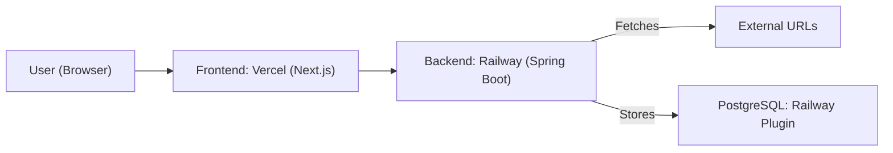

# Extractly: AI-Powered Content Extractor & Summariser


A full-stack web app that extracts the main text from any public URL, summarises it using open-source NLP (HuggingFace BART Inference API with a local frequency-based fallback), and presents the result in a Notion-style editable table with PDF export and persistent history.

---

## Table of Contents

- [Features](#features)
- [Tech Stack](#tech-stack)
- [How It Works](#how-it-works)
- [Prerequisites](#prerequisites)
- [Installation](#installation)
- [Configuration](#configuration)
- [Usage](#usage)
- [API Endpoints](#api-endpoints)
- [Project Structure](#project-structure)
- [Limitations](#limitations)
- [License](#license)

---

## Features

- Extracts main content from any public URL (removes nav, footer, ads; prefers `<main>` / `<article>` / largest `<div>`)
- Summarises content via HuggingFace BART Inference API; falls back to a local frequency-based summariser when the API key is absent
- Produces a multi-paragraph summary and up to 7 key points
- Notion-style key-points table: inline editing, deletion with animation, search with highlight, pagination (5 per page)
- Export the current summary and key points as a PDF (jsPDF)
- Persistent extraction history stored in PostgreSQL — searchable and editable
- Modern, responsive UI (Tailwind CSS + shadcn/ui, loading skeletons, toast notifications)
- Includes basic unit and integration tests (Jest, Testing Library, Maven)
- Deployable on Vercel (frontend) and Railway (backend + PostgreSQL)

---

## Screenshots

### Summary Extraction with PDF Export


### Key Points Table


### Extraction History


### Search Functionality


### Edit Functionality


---

## Tech Stack

| Layer | Technology |
|-------|-----------|
| Frontend | Next.js 14, React 18, Tailwind CSS 3, shadcn/ui, jsPDF |
| Backend | Java 17, Spring Boot 3.x, JSoup 1.17 |
| Database | PostgreSQL 16 (Spring Data JPA) |
| Summarisation | HuggingFace BART (`facebook/bart-large-cnn`) or local frequency-based NLP |
| Deployment | Vercel (frontend), Railway (backend + DB) |
| Containers | Docker, Docker Compose (local dev) |
| Testing | Jest, @testing-library/react, Maven Surefire |

---

## How It Works

1. **Extraction** — JSoup fetches the target URL and strips boilerplate (nav, footer, ads, scripts). It then tries `<main>`, `<article>`, and the largest `<div>` in that order before falling back to `<body>`.
2. **Summarisation** — If `HUGGINGFACE_API_KEY` is set, the text is split into 500-character chunks and sent to the BART large CNN model on HuggingFace's free Inference API. The chunk summaries are joined and split into paragraphs. If the API is unavailable or the key is absent, a local frequency-based algorithm scores and selects the most informative sentences.
3. **Key Points** — Seven sentences are ranked by term frequency from the summary and returned as key points.
4. **Persistence** — Each extraction (URL + raw content + summary) is saved to PostgreSQL so the history is browsable and editable across sessions.

---

## Prerequisites

- **Java 17+** and **Maven 3.9+** (backend)
- **Node.js 18+** and **npm** (frontend)
- **Docker Desktop** (for local PostgreSQL via Docker Compose)
- A free [HuggingFace account](https://huggingface.co/settings/tokens) for better summaries (optional)

---

## Installation

### 1. Start the local database

```sh
docker-compose up -d
```

This starts PostgreSQL 16 at `localhost:5432` with:
- Database: `aiextractor`
- User: `postgres`
- Password: `postgres`

### 2. Run the backend

```sh
cd backend
mvn clean install
mvn spring-boot:run
```

The API starts at `http://localhost:8080`.

### 3. Run the frontend

```sh
cd frontend
cp .env.local.example .env.local   # then edit NEXT_PUBLIC_API_BASE_URL if needed
npm install
npm run dev
```

The app opens at `http://localhost:3000`.

---

## Configuration

### Frontend (`frontend/.env.local`)

| Variable | Description |
|----------|-------------|
| `NEXT_PUBLIC_API_BASE_URL` | Base URL of the backend API (e.g. `http://localhost:8080/api`) |

Copy `frontend/.env.local.example` to `frontend/.env.local` and set the value.

### Backend (`backend/src/main/resources/application.properties`)

The file contains defaults for local development (Docker Compose). Override with environment variables in production:

| Variable | Description |
|----------|-------------|
| `SPRING_DATASOURCE_URL` | PostgreSQL JDBC URL |
| `SPRING_DATASOURCE_USERNAME` | Database username |
| `SPRING_DATASOURCE_PASSWORD` | Database password |
| `HUGGINGFACE_API_KEY` | HuggingFace Inference API key (optional) |
| `PORT` | HTTP port (default `8080`) |

---

## Usage

1. Paste any public URL into the input field and click **Extract**.
2. The summary appears as paragraphs; key points appear in the table below.
3. **Edit** a key point by double-clicking or clicking the Edit button; **Delete** removes it with an animation.
4. **Search** filters key points in real time with highlighted matches.
5. Click **Download Summary as PDF** to export the current view.
6. Scroll to **Extraction History** to browse, search, edit, or delete past extractions.

---

## API Endpoints

| Method | Path | Description |
|--------|------|-------------|
| `POST` | `/api/extract` | Extract and summarise content from a URL; saves to DB |
| `GET` | `/api/extracted` | Paginated, searchable extraction history |
| `PUT` | `/api/extracted/{id}` | Edit a stored extraction (url, content, or summary) |
| `DELETE` | `/api/extracted/{id}` | Delete a stored extraction |

**POST `/api/extract` request body:**
```json
{ "url": "https://example.com" }
```

**Response:**
```json
{ "summary": "...", "keyPoints": ["...", "..."] }
```

---

## Project Structure

```
url-content-extractor-summariser/
├── backend/
│   ├── src/main/java/com/aiextractor/extractor/
│   │   ├── ExtractorApplication.java       # Spring Boot entry point
│   │   ├── WebConfig.java                  # CORS configuration
│   │   ├── controllers/
│   │   │   └── ExtractController.java      # REST API (4 endpoints)
│   │   ├── services/
│   │   │   ├── HtmlExtractorService.java   # JSoup HTML parsing
│   │   │   └── SummarizationService.java   # NLP summarisation (HuggingFace + fallback)
│   │   ├── models/
│   │   │   ├── ExtractedContent.java       # JPA entity
│   │   │   ├── ExtractedContentRepository.java
│   │   │   └── SummaryResponse.java        # Response DTO
│   │   └── utils/
│   │       └── JsoupUtils.java
│   ├── Dockerfile
│   └── pom.xml
├── frontend/
│   ├── pages/
│   │   ├── index.jsx                       # Main application
│   │   └── _app.jsx
│   ├── components/
│   │   ├── UrlInput.jsx
│   │   ├── SummaryBox.jsx
│   │   ├── KeyPointsTable.jsx
│   │   └── ui/                             # shadcn/ui primitives
│   ├── styles/globals.css
│   ├── __tests__/App.test.jsx
│   └── package.json
├── screenshots/
├── docker-compose.yml
└── LICENSE
```

---

## Deployment

### Backend on Railway

1. Push the repo to GitHub and create a new Railway project from it.
2. Set the service root to `backend/`.
3. Add the Railway PostgreSQL plugin and copy the connection details.
4. Set environment variables in Railway:
   ```
   SPRING_DATASOURCE_URL=jdbc:postgresql://<host>:<port>/<db>
   SPRING_DATASOURCE_USERNAME=<user>
   SPRING_DATASOURCE_PASSWORD=<password>
   HUGGINGFACE_API_KEY=<your_key>
   ```

### Frontend on Vercel

1. Import the repo in Vercel; set the root directory to `frontend/`.
2. Add the environment variable:
   ```
   NEXT_PUBLIC_API_BASE_URL=https://<your-railway-backend>.up.railway.app/api
   ```

### Architecture



---

## Testing

```sh
# Backend
cd backend && mvn test

# Frontend
cd frontend && npm test
```

Tests cover the Spring application context load (backend) and URL submission/error flows (frontend).

---

## Limitations

- **JavaScript-heavy pages (SPAs) are not supported** — JSoup fetches raw HTML; pages that render content client-side will return little or no text.
- **HuggingFace BART quality varies** — the free Inference API uses a shared queue and can time out or return low-quality summaries on short or poorly structured text.
- **Local fallback is frequency-based, not ML** — it selects high-frequency sentences; it does not "understand" the text.
- **No authentication** — extraction history is globally shared; anyone with access to the backend URL can read or delete all records.
- **Test coverage is minimal** — two frontend smoke tests and one Spring context-load test; there are no integration tests for the extraction or summarisation pipeline.
- **PDF export reflects in-memory state only** — deleted or edited key points update the export, but the database record is not synchronised automatically.
- **Extraction quality is site-dependent** — paywalled, login-gated, or heavily structured pages (e.g. social media) may yield incomplete or empty content.

---

## License

Released under the [MIT License](LICENSE).
